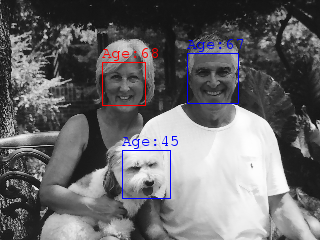
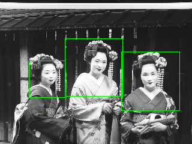
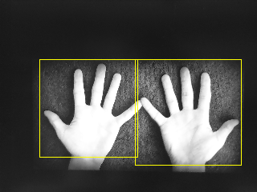

node-omron-hvc-p2
===============

node-omron-hvc-p2 は、画像センシングデバイス "[OMRON Human Vision Components (HVC-P2)](http://plus-sensing.omron.co.jp/product/hvc-p2.html)" を USB シリアルポート経由で操作するための node モジュールです。


[HVC-P2](http://www.omron.com/ecb/products/mobile/hvc_p2/) は以下の機能をサポートしています：

* 人体検出
* 手検出
* 顔検出
* 顔向き推定
* 年齢推定
* 性別推定
* 視線推定
* 目つむり推定
* 表情推定
* 顔認証

node-omron-hvc-p2 は、[HVC-P2](http://www.omron.com/ecb/products/mobile/hvc_p2/) のすべての機能をサポートしています。また、カメラの映像を GIF, JPEG, PNG 画像ファイルとして保存することもできます。

## 依存関係

* [Node.js](https://nodejs.org/en/) 6 +
* [serialport](https://github.com/EmergingTechnologyAdvisors/node-serialport)
* [node-gd](https://github.com/y-a-v-a/node-gd) (Optional, for Linux, Mac)
* [lwip](https://github.com/EyalAr/lwip) (Optional, for Windows)

## インストール

```
$ cd ~
$ npm install serialport
$ npm install node-omron-hvc-p2
```

node-omron-hvc-p2 は、HVC-P2 で撮影した画像を生成するために、画像処理モジュールが必要です。Linux と Mac では [node-gd](https://github.com/y-a-v-a/node-gd) が、Windows では [lwip](https://github.com/EyalAr/lwip) が必要となります。

HVC-P2 で撮影した画像を必要としない場合、これらの画像処理モジュールは不要です。

### Debian/Ubuntu

[node-gd](https://github.com/y-a-v-a/node-gd) をインストールしてください。

```
$ sudo apt-get install libgd2-dev # libgd
$ npm install node-gd
```

### RHEL/CentOS

[node-gd](https://github.com/y-a-v-a/node-gd) をインストールしてください。

```
$ sudo yum install gd-devel
$ npm install node-gd
```

### Mac OS

[node-gd](https://github.com/y-a-v-a/node-gd) をインストールしてください。

```
$ sudo port install pkgconfig gd2
$ npm install node-gd
```

### Windows

[lwip](https://github.com/EyalAr/lwip) をインストールしてください。

```
$ npm install lwip
```

---------------------------------------
## 目次

* [クイックスタート](#Quick-Start)
  * [顔を検出する](#Quick-Start-1)
  * [画像を取得する](#Quick-Start-2)
* [`HvcP2` オブジェクト](#HvcP2-object)
  * [connect(*[params]*) メソッド](#HvcP2-connect-method)
  * [disconnect() メソッド](#HvcP2-disconnect-method)
  * [getSerialPortPath() メソッド](#HvcP2-getSerialPortPath-method)
  * [getModelVersion(*[params]*) メソッド](#HvcP2-getModelVersion-method)
  * [detect(*params*) メソッド](#HvcP2-detect-method)
    * [顔検出](#HvcP2-detect-method-face)
    * [人体検出](#HvcP2-detect-method-body)
    * [手検出](#HvcP2-detect-method-hand)
  * [getConfigurations(*[params]*) メソッド](#HvcP2-getConfigurations-method)
  * [setConfigurations(*configrations*) メソッド](#HvcP2-setConfigurations-method)
  * [resetConfigurations() メソッド](#HvcP2-resetConfigurations-method)
  * [getFaceRecognitionData(*params*) メソッド](#HvcP2-getFaceRecognitionData-method)
  * [getFaceRecognitionUsers(*[params]*) メソッド](#HvcP2-getFaceRecognitionUsers-method)
  * [addFaceRecognitionData(*params*) メソッド](#HvcP2-addFaceRecognitionData-method)
  * [deleteFaceRecognitionData(*params*) メソッド](#HvcP2-deleteFaceRecognitionData-method)
  * [deleteFaceRecognitionUser(*params*) メソッド](#HvcP2-deleteFaceRecognitionUser-method)
  * [clearFaceRecognitionData() メソッド](#HvcP2-clearFaceRecognitionData-method)
  * [saveAlbum(*params*) メソッド](#HvcP2-saveAlbum-method)
  * [loadAlbum(*params*) メソッド](#HvcP2-loadAlbum-method)
  * [saveAlbumOnFlashROM() メソッド](#HvcP2-saveAlbumOnFlashROM-method)
  * [reformatFlashROM() メソッド](#HvcP2-reformatFlashROM-method)
* [リリースノート](#Release-Note)
* [リファレンス](#References)
* [ライセンス](#License)

---------------------------------------
## <a id="Quick-Start">クイックスタート</a>

### <a id="Quick-Start-1">顔を検出する</a>

このサンプルコードは、HVC-P2 に接続し、顔検出コマンドを送信します。

```JavaScript
// Load the node-omron-hvc-p2 and get a `HvcP2` constructor object
const HvcP2 = require('node-omron-hvc-p2');
// Create a `HvcP2` object
const hvcp2 = new HvcP2();

// Connect to the HVC-P2
hvcp2.connect().then(() => {
  // Send a command for detecting
  return hvcp2.detect({
    face   : 1, // Enable face detection
    age    : 1, // Enable age estimation
    gender : 1  // Enable gender Estimation
  });
}).then((res) => {
  // Show the result
  console.log(JSON.stringify(res, null, '  '));
  // Disconnect the HVC-P2
  return hvcp2.disconnect();
}).then(() => {
  console.log('Disconnected.');
}).catch((error) => {
  console.error(error);
});
```

まずは、`HvcP2` コンストラクタオブジェクトから [`HvcP2`](#HvcP2-object) オブジェクトを生成しなければいけません。上記コードでは、変数 `hvcp2` が [`HvcP2`](#HvcP2-object) オブジェクトです。

[`connect()`](#HvcP2-connect-method) メソッドを呼び出すと、node-omron-hvc-p2 は HVC-P2 が接続された USB シリアルポートを探索し始め、利用可能な状態にするための準備を行います。

[`detect()`](#HvcP2-detect-method) メソッドを呼び出すと、node-omron-hvc-p2 はコマンドを送って、カメラに写っている顔を検出させます。HVC-P2 は数多くの検出オプションをサポートしています。上記コードでは、顔検出、年齢推定、性別推定を有効にしています。

上記コードの結果は次の通りになります：

```
{
  "face": [
    {
      "face": {
        "x": 930,
        "y": 497,
        "size": 390,
        "confidence": 579
      },
      "age": {
        "age": 41,
        "confidence": 500
      },
      "gender": {
        "gender": 1,
        "confidence": 1000
      }
    }
  ]
}
Disconnected.
```

この結果から、一つの顔が検出され、その年齢は 41 歳、性別は男性ということが分かります。

最後に、[`disconnect()`](#HvcP2-disconnect-method) メソッドを使ってデバイスを切断します。

### <a id="Quick-Start-2">画像を取得する</a>

[`detect()`](#HvcP2-detect-method) メソッドは画像データを返すこともできます。以下のコードでは、画像に関連するいくつかのパラメータがこのメソッドに引き渡されています。

```JavaScript
// Load the node-omron-hvc-p2 and get a `HvcP2` constructor object
const HvcP2 = require('node-omron-hvc-p2');
// Create a `HvcP2` object
const hvcp2 = new HvcP2();

// Connect to the HVC-P2
hvcp2.connect().then(() => {
  // Send a command for detecting
  return hvcp2.detect({
    face        : 1,            // Enable face detection
    age         : 1,            // Enable age estimation
    image       : 1,            // Enable capturing image
    imageType   : 3,            // Save the image as a file
    imageFormat : 'png',        // Image format
    imagePath   : './test.png', // File path
    imageMarker : true          // Draw markers in the image
  });
}).then((res) => {
  // Show the result
  console.log(JSON.stringify(res, null, '  '));
  // Disconnect the HVC-P2
  return hvcp2.disconnect();
}).then(() => {
  console.log('Disconnected.');
}).catch((error) => {
  console.error(error);
});
```

上記サンプルコードの結果は次のようになります：

```
{
  "face": [
    {
      "face": {
        "x": 624,
        "y": 588,
        "size": 330,
        "confidence": 559
      },
      "age": {
        "age": 25,
        "confidence": 666
      }
    }
  ],
  "image": {
    "width": 320,
    "height": 240
  }
}
Disconnected.
```

さらに、カレントディレクトリに画像ファイルが生成されます。スクリプトが Linux か Mac で実行されたなら、その画像は次のようになります：


もし検出された顔が女性と認識されたなら、マーカーの色は赤になります。もし男性と認識されたなら、その色は青になります。

スクリプトが Windows で実行されたなら、その画像は次のようになります：


ご覧の通り、Windows では年齢マーカーはサポートされませんので注意してください。

---------------------------------------
## <a id="HvcP2-object">`HvcP2` オブジェクト</a>

node-omron-hvc-p2 を利用するためには、次の通り、node-omron-hvc-p2 モジュールをロードします：

```JavaScript
const HvcP2 = require('node-omron-hvc-p2');
```

上記のコードから、`HvcP2` コンストラクタが得られます。次の通り、その `HvcP2` コンストラクタから `HvcP2` オブジェクトを生成しなければいけません：

```JavaScript
const hvcp2 = new HvcP2();
```

上記コードでは、変数 `hvcp2` が `HvcP2` オブジェクトです。`HvcP2` オブジェクトは、以降のセクションで説明するとおり、いくつかのメソッドを持っています。

### <a id="HvcP2-connect-method">connect(*[params]*) メソッド</a>

`connect()` メソッドは、ホスト PC の USB ポートに接続された HVC-P2 を探し、利用可能な状態に準備を行います。このメソッドは `Promise` オブジェクトを返します。

```JavaScript
hvcp2.connect().then(() => {
  console.log('Connected.');
  // Do something.
}).catch((error) => {
  console.error(error);
});
```

基本的に HVC-P2 がどのシリアルポートに接続されているかは知らなくても構いません。このメソッドは、適切な USB シリアルポートを探索します。さらに、ボーレートも指定する必要はありません。少なくとも最新の Linux ディストリビューション (Raspbian や Ubuntu)、Mac、Windows であれば期待通りに動作するはずです。

しかし、必ずしも node-omron-hvc-p2 が適切な USB シリアルポートを発見できるとは限りません。その場合は、USB シリアルポートとボーレートを指定することができます。

```JavaScript
hvcp2.connect({
  path: 'COM4',
  baudRate: 921600
}).then(() => {
  console.log('Connected.');
  // Do something.
}).catch((error) => {
  console.error(error);
});
```

`connect()` メソッドは次のプロパティを含むハッシュオブジェクトを引数に取ります：

プロパティ  | 必須 | 型     | 説明
:----------|:-----|:-------|:-----------
`path`     | 任意 | String | HVC-P2 が接続されあtシリアルポートを表すパスを指定します。(例： "COM3", "/dev/ttyACM0", "/dev/tty-usbserial1")
`baudRate` | 任意 | Number | `9600`, `38400`, `115200`, `230400`, `460800`, `921600` (デフォルト) のいずれか。

接続プロセスをできる限り早く終わらせたいなら、`path` を指定したほうが良いでしょう。なぜなら、自動スキャンモード (`path` を指定しない) は、ホスト PC の環境によって少し時間がかかるからです。

### <a id="HvcP2-disconnect-method">disconnect() メソッド</a>

`disconnect()` メソッドは、USB ポートの HVC-P2 とのコネクションを開放 (切断) します。このメソッドは `Promise` オブジェクトを返します。

```JavaScript
hvcp2.disconnect().then(() => {
  console.log('Disconnected.');
}).catch((error) => {
  console.error(error);
});
```

### <a id="HvcP2-getSerialPortPath-method">getSerialPortPath() メソッド</a>

`getSerialPortPath()` メソッドは、HVC-P2 に割り当てられた USB シリアルポートを表すパスを返します。このメソッドは、他のメソッドとは異なり、`Promise` オブジェクトを返しませんので注意してください。

```JavaScript
hvcp2.connect().then(() => {
  console.log('Serial Port Path: ' + hvcp2.getSerialPortPath());
}).catch((error) => {
  console.error(error);
});
```

上記コードが Windows で実行されたなら、次のような結果を返します：

```
Serial Port Path: COM4
```

もし上記コードが Raspbian で実行されたなら、次のような結果を返します：

```
Serial Port Path: /dev/ttyACM0
```

このメソッドは、HVC-PC が [`connect()`](#HvcP2-connect-method) メソッドを使って接続されていなければ、空文字列を返します。

### <a id="HvcP2-getModelVersion-method">getModelVersion(*[params]*) メソッド</a>

`getModelVersion()` メソッドは HVC-P2 のモデル名とバージョン番号を報告します。このメソッドは `Promise` オブジェクトを返します。このメソッドは、次のプロパティを含んだハッシュオブジェクトを引数に取ります：

プロパティ | 型    | 必須 | 説明
:--------|:--------|:---------|:------------
`cache`  | Boolean | 任意 | `true` (デフォルト) または `false`。 `true` を指定または何も指定しなければ、このメソッドは `connect()` メソッドが呼び出されたときにキャッシュされたデータを報告します。`false` が指定されると、このメソッドは HVC-P2 にリクエストします。

node-omron-hvc-p2 は、[`connect()`](#HvcP2-connect-method) メソッドが呼び出されたとき、モデル名とバージョン番号をキャッシュします。モデル名とバージョン番号は決して変わることはないため、このメソッドは、デフォルトでキャッシュされた情報を報告します。しかし、もし再度問合せしたい場合は、`cache` プロパティを指定して、その値を `false` にセットしてください。

以下のコードは、キャッシュされた情報を表示します。

```JavaScript
hvcp2.getModelVersion().then(() => {
  console.log(JSON.stringify(res, null, '  '));
}).catch((error) => {
  console.error(error);
});
```

以下のコードは、新たに問い合わせた情報を表示します。

```JavaScript
hvcp2.getModelVersion({cache: false}).then(() => {
  console.log(JSON.stringify(res, null, '  '));
}).catch((error) => {
  console.error(error);
});
```

上記コードは次のような結果を出力します：

```
{
  "model": "B5T-007001",
  "major": 1,
  "minor": 0,
  "release": 1,
  "revision": 9372
}
```

### <a id="HvcP2-detect-method">detect(*params*) メソッド</a>

`detect()` メソッドは、HVC-P2 に、カメラに捕らえられた対象物を検出させます。このメソッドは `Promise` オブジェクトを返します。このメソッドは、次のプロパティを含んだハッシュオブジェクトを引数に取ります：

プロパティ     | 型      | 必須 | 説明
:-------------|:--------|:-----|:------------
`body`        | Number  | 任意 | 人体検出 (`0`: 無効 (デフォルト), `1`: 有効)
`hand`        | Number  | 任意 | 手検出 (`0`: 無効 (デフォルト), `1`: 有効)
`face`        | Number  | 任意 | 顔検出 (`0`: 無効 (デフォルト), `1`: 有効)
`direction`   | Number  | 任意 | 顔向き推定 (`0`: 無効 (デフォルト), `1`: 有効)
`age`         | Number  | 任意 | 年齢推定 (`0`: 無効 (デフォルト), `1`: 有効)
`gender`      | Number  | 任意 | 性別推定 (`0`: 無効 (デフォルト), `1`: 有効)
`gaze`        | Number  | 任意 | 視線推定 (`0`: 無効 (デフォルト), `1`: 有効)
`blink`       | Number  | 任意 | 目つむり推定 (`0`: 無効 (デフォルト), `1`: 有効)
`expression`  | Number  | 任意 | 表情推定 (`0`: 無効 (デフォルト), `1`: 有効)
`recognition` | Number  | 任意 | 顔認証 (`0`: 無効 (デフォルト), `1`: 有効)
`image`       | Number  | 任意 | 画像出力 (`0`: 無効 (デフォルト), `1`: 320x240 pixel, 2: 160x120 pixel)
`imageType`   | Number  | 任意 | `0`: Array (デフォルト), `1`: Buffer, `2`: Data URL, `3`: File
`imageFormat` | String  | 任意 | `"gif"` (デフォルト), `"jpg"`, or `"png"`
`imagePath`   | String  | 条件 | 画像ファイルのパス (例：`"/tmp/image.png"`)
`imageMarker` | Boolean | 任意 | マーカー表示 (`true`: 表示, `false`: 非表示 (デフォルト))

すべてのプロパティが任意ですが、`body`, `hand`, `face`, `direction`, `age`, `gender`, `gaze`, `blink`, `expression`, `recogunition`, `image` のうち、少なくともひとつは `1` をセットしなければいけません。

`imagePath` は、`image` が `1` または `2`、かつ、`imageType` が `3` (File) の場合は、必須です。

検出の結果は 次のプロパティを含んだハッシュオブジェクトが `resolve()` 関数に引き渡されます。

プロパティ | 型    | 説明
:--------|:-------|:-----------
`body`   | Array  | 人体検出の結果です。このプロパティは、リクエストパラメータ `body` が `1` の場合にのみ存在します。そうでなければこのプロパティは存在しません。詳細は "[人体検出](#HvcP2-detect-method-body)" の章を参照してください。
`hand`   | Array  | 手検出の結果です。このプロパティは、リクエストパラメータ `hand` が `1` の場合にのみ存在します。そうでなければこのプロパティは存在しません。詳細は "[手検出](#HvcP2-detect-method-hand)" の章を参照してください。
`face`   | Array  | 顔関連の検出の結果です。このプロパティは、リクエストパラメータ `face`, `direction`, `age`, `gender`, `gaze`, `blink`, `expression`, `recognition` のいずれかひとつが `1` の場合にのみ存在します。そうでなければこのプロパティは存在しません。詳細は "[顔検出](#HvcP2-detect-method-face)" の章を参照してください。
`image`  | Object | イメージデータです。このプロパティは、リクエストパラメータ `image` が `1` または `2` の場合にのみ存在します。そうでなければこのプロパティは存在しません。
+`width` | Number | イメージの幅です (pixel)。
+`height` | Number | イメージの高さです (pixel)。
+`pixels`  | Array  | イメージのピクセルデータです。このプロパティは、リクエストパラメータ `imageType` が `0` の場合にのみ存在します。
+`buffer`  | Buffer | イメージを表す Buffer オブジェクトです。このプロパティは、リクエストパラメータ `imageType` が `1` の場合にのみ存在します。
+`dataUrl` | String | イメージを表す Data URL です。このプロパティは、リクエストパラメータ `imageType` が `2` の場合にのみ存在します。

`pixels` プロパティのピクセルデータは、HVC-P2 のカメラによって撮られたグレースケールのイメージを表します。配列のそれぞれの要素は、そのイメージのピクセルを表します。値は 0 から 255 の整数でグレースケールのレベルを表します。配列の最初の要素は、左上端のピクセルに相当します。配列の最後の要素は、右下端のピクセルに相当します。イメージのサイズが 320x240 なら、配列の要素数は 76800 になります。

`buffer` プロパティの値は、イメージのバイナリーデータを表す `Buffer` オブジェクトです。そのイメージのフォーマットは、パラメーター `imageFormat` に依存します。

`dadtaUrl` プロパティの値は、次のように、イメージの data URL になります：

```
data:image/png;base64,iVBORw0KGgoAAAANSU...AElFTkSuQmCC
```

#### <a id="HvcP2-detect-method-face">顔検出</a>

以下のコードは、顔検出に関連するオプションすべてに `1` (有効) をセットし、カレントディレクトリにマーカー付きの PNG ファイルを生成します。

```JavaScript
hvcp2.detect({
    face: 1,
    direction: 1,
    age: 1,
    gender: 1,
    gaze: 1,
    blink: 1,
    expression: 1,
    recognition: 1,
    image: 1,
    imageType: 3,
    imageFormat: 'png',
    imagePath: './capture.png',
    imageMarker: true
  });
}).then((res) => {
  console.log(JSON.stringify(res, null, '  '));
}).catch((error) => {
  console.error(error);
});
```

以下のイメージは検出結果です。3 つの顔が検出されています (2 つの人間の顔と 1 つの犬の顔)。なお、HVC-P2 は人間の顔検知を想定したものであり、犬の顔の見地を想定したものではありませんので注意してください。


([The original picture](https://visualhunt.com/photo/106582/))

結果は次のようになります：

```JavaScript
{
  "face": [
    {
      "face": {
        "x": 1062,
        "y": 389,
        "size": 252,
        "confidence": 533
      },
      "direction": {
        "yaw": 2,
        "pitch": -15,
        "roll": -2,
        "confidence": 19
      },
      "age": {
        "age": 67,
        "confidence": 333
      },
      "gender": {
        "gender": 1,
        "confidence": 767
      },
      "gaze": {
        "yaw": 3,
        "pitch": -9
      },
      "blink": {
        "left": 432,
        "right": 407
      },
      "expression": {
        "neutral": 1,
        "happiness": 73,
        "surprise": 0,
        "anger": 8,
        "sadness": 18,
        "positive": 47
      },
      "recognition": {
        "user": -127,
        "score": -127
      }
    },
    {
      "face": {
        "x": 728,
        "y": 870,
        "size": 240,
        "confidence": 566
      },
      "direction": {
        "yaw": 6,
        "pitch": -13,
        "roll": -12,
        "confidence": 1
      },
      "age": {
        "age": 45,
        "confidence": 153
      },
      "gender": {
        "gender": 1,
        "confidence": 713
      },
      "gaze": {
        "yaw": -4,
        "pitch": 3
      },
      "blink": {
        "left": 418,
        "right": 465
      },
      "expression": {
        "neutral": 44,
        "happiness": 1,
        "surprise": 15,
        "anger": 39,
        "sadness": 1,
        "positive": -50
      },
      "recognition": {
        "user": -127,
        "score": -127
      }
    },
    {
      "face": {
        "x": 618,
        "y": 417,
        "size": 216,
        "confidence": 671
      },
      "direction": {
        "yaw": 3,
        "pitch": -20,
        "roll": 1,
        "confidence": 1
      },
      "age": {
        "age": 68,
        "confidence": 400
      },
      "gender": {
        "gender": 0,
        "confidence": 538
      },
      "gaze": {
        "yaw": 4,
        "pitch": -2
      },
      "blink": {
        "left": 366,
        "right": 455
      },
      "expression": {
        "neutral": 0,
        "happiness": 100,
        "surprise": 0,
        "anger": 0,
        "sadness": 0,
        "positive": 100
      },
      "recognition": {
        "user": -127,
        "score": -127
      }
    }
  ],
  "image": {
    "width": 320,
    "height": 240
  }
}
```

プロパティの意味は次の通りです：

プロパティ      | 型   | 説明
:--------------|:-------|:-----------
`face`         | Object | 顔検出の結果です。
+`x`          | Number | カメラのビューポート (1920 x 1080) における検出された顔の中心の x 座標です。
+`y`          | Number | カメラのビューポート (1920 x 1080) における検出された顔の中心の y 座標です。
+`size`       | Number | 検出された顔を表す正方形のサイズです。
+`confidence` | Number | 顔検出の信頼度です。(0 ～ 1000)
`direction`    | Object | 顔向き推定の結果です。
+`yaw`        | Number | 検出された顔の左右方向角度です。単位は度です。顔が左を向いているなら正、右を向いているなら負の値になります。
+`pitch`      | Number | 検出された顔の上下方向角度です。単位は度です。顔が上を向いているなら正、下を向いているなら負の値になります。
+`roll`       | Number | 検出された顔の傾き角度です。単位は度です。顔が左に傾いているなら正、右に傾いているなら負の値になります。
+`confidence` | Number | 顔向き推定の信頼度です。(0 ～ 1000)
`age`          | Object | 年齢推定の結果です。
+`age`        | Number | 検出された顔から推定された年齢です。最大値は 75 です。
+`confidence` | Number | 年齢推定の信頼度です。(0 ～ 1000)
`gender`       | Object | 性別推定の結果です。
+`gender`     | Number | 検出された顔から推定された性別です。`0` なら女性を、`1` なら男性を意味します。
+`confidence` | Number | 性別推定の信頼度です。(0 ～ 1000)
`gaze`         | Object | 視線推定の結果です。
+`yaw`        | Number | 検出された顔の視線の左右角度です。単位は度です。検出された顔の目が左を向いているなら正、右を向いているなら負の値になります。
+`pitch`      | Number | 検出された顔の視線の上下角度です。単位は度です。検出された顔の目が上を向いているなら正、下を向いているなら負の値になります。
`blink`        | Object | 目つむり推定の結果です。
+`left`       | Number | 検出された顔の左目の目つむりの度合いです。目が完全に開いていれば 1、完全に閉じていれば 1000 になります。
+`right`      | Number | 検出された顔の右目の目つむりの度合いです。目が完全に開いていれば 1、完全に閉じていれば 1000 になります。
`expression`   | Object | 表情推定の結果です。
+`neutral`    | Number | 検出された顔から推定された無表情の度合いです。値の範囲は 0 ～ 100 です。
+`happiness`  | Number | 検出された顔から推定された喜びの度合いです。値の範囲は 0 ～ 100 です。
+`surprise`   | Number | 検出された顔から推定された驚きの度合いです。値の範囲は 0 ～ 100 です。
+`anger`      | Number | 検出された顔から推定された怒りの度合いです。値の範囲は 0 ～ 100 です。
+`sadness`    | Number | 検出された顔から推定された悲しみの度合いです。値の範囲は 0 ～ 100 です。
+`positive`   | Number | 検出された顔から推定されたポジティブの度合いです。値の範囲は -100 ～ 100 です。値が正なら、検出された顔は喜んでいるように見えます。値が負なら、検出された顔は悲しんでいる、または、怒っているように見えます。
`recognition`  | Object | 顔認証の結果です。
+`userId`       | Number | 検出された顔から認識されたユーザー ID です。ユーザーを認識できなければ、この値は -127 になります。
+`score`      | Number | 認識のスコアです。値の範囲は 0 ～ 1000 です。ユーザーを認識できなければ、この値は -127 になります。

#### <a id="HvcP2-detect-method-body">人体検出</a>

以下のコードは、人体検出オプションに `1` (有効) をセットし、カレントディレクトリにマーカー付きの PNG 画像を生成します。

```JavaScript
hvcp2.detect({
    body: 1,
    image: 1,
    imageType: 3,
    imageFormat: 'png',
    imagePath: './capture.png',
    imageMarker: true
  });
}).then((res) => {
  console.log(JSON.stringify(res, null, '  '));
}).catch((error) => {
  console.error(error);
});
```

以下のイメージは検出の結果です。3 つの人体が検出されています。


([The original picture](https://visualhunt.com/photo/68310/))

結果は以下のようになります：

```
{
  "body": [
    {
      "x": 1252,
      "y": 674,
      "size": 488,
      "confidence": 889
    },
    {
      "x": 780,
      "y": 560,
      "size": 480,
      "confidence": 552
    },
    {
      "x": 390,
      "y": 656,
      "size": 304,
      "confidence": 642
    }
  ],
  "image": {
    "width": 320,
    "height": 240
  }
}

```

上記プロパティの意味は次の通りです：

プロパティ     | 型   | 説明
:------------|:-------|:-----------
`x`          | Number | カメラのビューポート (1920 x 1080) における検出された人体の中心の x 座標です。
`y`          | Number | カメラのビューポート (1920 x 1080) における検出された人体の中心の y 座標です。
`size`       | Number | 検出された人体を表す正方形のサイズです。
`confidence` | Number | 人体検出の信頼度です。(0 ～ 1000)

#### <a id="HvcP2-detect-method-hand">手検出</a>

以下のコードは、手検出オプションに `1` (有効) をセットし、カレントディレクトリにマーカー付きの PNG ファイルを生成します。

```JavaScript
hvcp2.detect({
    hand: 1,
    image: 1,
    imageType: 3,
    imageFormat: 'png',
    imagePath: './capture.png',
    imageMarker: true
  });
}).then((res) => {
  console.log(JSON.stringify(res, null, '  '));
}).catch((error) => {
  console.error(error);
});
```

以下のイメージは検出結果です。2 つの手が検出されています。


([The original picture](https://visualhunt.com/f/photo/8197817878/c0ba443eb0/))

結果は次のようになります：

```JavaScript
{
  "hand": [
    {
      "x": 1168,
      "y": 699,
      "size": 661,
      "confidence": 1000
    },
    {
      "x": 550,
      "y": 675,
      "size": 608,
      "confidence": 972
    }
  ],
  "image": {
    "width": 320,
    "height": 240
  }
}
```

上記プロパティの意味は次の通りです：

プロパティ     | 型   | 説明
:------------|:-------|:-----------
`x`          | Number | カメラのビューポート (1920 x 1080) における検出された手の中心の x 座標です。
`y`          | Number | カメラのビューポート (1920 x 1080) における検出された手の中心の y 座標です。
`size`       | Number | 検出された手を表す正方形のサイズです。
`confidence` | Number | 手検出の信頼度です。(0 ～ 1000)

### <a id="HvcP2-getConfigurations-method">getConfigurations(*[params]*) メソッド</a>

`getConfigurations()` メソッドは、HVC-P2 の設定情報を報告します。このメソッドは `Promise` オブジェクトを返します。このメソッドは、次のプロパティを含んだハッシュオブジェクトを引数に取ります：

プロパティ | 型    | 必須 | 説明
:--------|:--------|:---------|:------------
`cache`  | Boolean | 任意 | `true` (デフォルト) または `false`。 `true` を指定または何も指定しなければ、このメソッドは `connect()` メソッドが呼び出されたときにキャッシュされたデータを報告します。`false` が指定されると、このメソッドは HVC-P2 にリクエストします。

node-omron-hvc-p2 は、[`connect()`](#HvcP2-connect-method) メソッドが呼び出されたとき、設定情報をキャッシュします。このメソッドは、デフォルトでキャッシュされた設定情報を報告します。しかし、もし再度問合せしたい場合は、`cache` プロパティを指定して、その値を `false` にセットしてください。

以下のコードは、キャッシュされた設定情報を表示します。

```JavaScript
hvcp2.getConfigurations().then((res) => {
  console.log(JSON.stringify(res, null, '  '));
}).catch((error) => {
  console.error(error);
});
```

以下のコードは、新たに問い合わせた情報を表示します。

```JavaScript
hvcp2.getConfigurations({cache: false}).then((res) => {
  console.log(JSON.stringify(res, null, '  '));
}).catch((error) => {
  console.error(error);
});
```

上記コードは次のような結果を出力します：

```JavaScript
{
  "cameraAngle": {
    "angle": 0
  },
  "threshold": {
    "body": 500,
    "hand": 500,
    "face": 500,
    "recognition": 500
  },
  "detectionSize": {
    "bodyMin": 30,
    "bodyMax": 8192,
    "handMin": 40,
    "handMax": 8192,
    "faceMin": 64,
    "faceMax": 8192
  },
  "faceAngle": {
    "yaw": 0,
    "roll": 0
  }
}
```

上記のプロパティの意味の詳細は、次の章 "[`setConfigurations()` メソッド](#HvcP2-setConfigurations-method)" を参照してください。

### <a id="HvcP2-setConfigurations-method">setConfigurations(*configrations*) メソッド</a>

`setConfigurations()` メソッドは設定情報をセットします。このメソッドは `Promise` オブジェクトを返します。このメソッドは、次のプロパティを含んだハッシュオブジェクトを引数に取ります：

プロパティ        | 型   | 必須 | 説明
:---------------|:-------|:---------|:------------
`cameraAngle`   | Object | 任意 | カメラ取付方向
+`angle`        | Number | 任意 | 0: 0º, 1: 90º, 2: 180º, 3: 270º
`threshold`     | Object | 任意 | しきい値
+`body`         | Number | 任意 | 人体検出しきい値 (1 ～ 1000)
+`hand`         | Number | 任意 | 手検出しきい値 (1 ～ 1000)
+`face`         | Number | 任意 | 顔検出しきい値 (1 ～ 1000)
+`recognition`  | Number | 任意 | 顔認証しきい値 (0 ～ 1000)
`detectionSize` | Object | 任意 | 検出サイズ
+`bodyMin`      | Number | 任意 | 人体検出最小サイズ (20 ～ 8192)
+`bodyMax`      | Number | 任意 | 人体検出最大サイズ (20 ～ 8192)
+`handMin`      | Number | 任意 | 手検出最小サイズ (20 ～ 8192)
+`handMax`      | Number | 任意 | 手検出最大サイズ (20 ～ 8192)
+`faceMin`      | Number | 任意 | 顔検出最小サイズ (20 ～ 8192)
+`faceMax`      | Number | 任意 | 顔検出最大サイズ (20 ～ 8192)
`faceAngle`     | Object | 任意 | 顔検出角度範囲
+`yaw`          | Number | 任意 | 左右角度範囲 (0: ±30º, 1: ±60º, 2: ±90º)
+`roll`         | Number | 任意 | 上下角度範囲 (0: ±15º, 1: ±45º)

すべてのプロパティが任意ですが、少なくともひとつのプロパティを指定しなければいけません。

設定に関して詳細は [Human Vision Components (HVC-P2) B5T-007001 コマンド仕様書 (PDF)](https://www.omron.co.jp/ecb/products/mobile/hvc_p2/file/B5T-007001_CommandSpecifications_JP_A.pdf) を参照してください。

更新後の設定情報は `resolve()` 関数に引き渡されます。上記と同じプロパティを含んだハッシュオブジェクトが引き渡されます。

以下のコードは、カメラ取付方向を 270º にセットします。

```JavaScript
hvcp2.setConfigurations({
  cameraAngle: {
    angle: 3 // Camera angle: 270º
  }
}).then((res) => {
  console.log(JSON.stringify(res, null, '  '));
}).catch((error) => {
  console.error(error);
});
```

上記コードは次のような結果を出力します：

```JavaScript
{
  "cameraAngle": {
    "angle": 3
  },
  "threshold": {
    "body": 500,
    "hand": 500,
    "face": 500,
    "recognition": 500
  },
  "detectionSize": {
    "bodyMin": 30,
    "bodyMax": 8192,
    "handMin": 40,
    "handMax": 8192,
    "faceMin": 64,
    "faceMax": 8192
  },
  "faceAngle": {
    "yaw": 0,
    "roll": 0
  }
}
```

### <a id="HvcP2-resetConfigurations-method">resetConfigurations() メソッド</a>

`resetConfigurations()` メソッドは、設定情報をデフォルトに戻します。このメソッドは `Promise` オブジェクトを返します。

更新後の設定情報は `resolve()` 関数に引き渡されます。上記のプロパティと同じものを含んだハッシュオブジェクトが引き渡されます。

```JavaScript
hvcp2.resetConfigurations().then((res) => {
  console.log(JSON.stringify(res, null, '  '));
}).catch((error) => {
  console.error(error);
});
```

上記コードは次のような結果を出力します：

```JavaScript
{
  "cameraAngle": {
    "angle": 0
  },
  "threshold": {
    "body": 500,
    "hand": 500,
    "face": 500,
    "recognition": 500
  },
  "detectionSize": {
    "bodyMin": 30,
    "bodyMax": 8192,
    "handMin": 40,
    "handMax": 8192,
    "faceMin": 64,
    "faceMax": 8192
  },
  "faceAngle": {
    "yaw": 0,
    "roll": 0
  }
}
```

### <a id="HvcP2-getFaceRecognitionUsers-method">getFaceRecognitionUsers(*[params]*) メソッド</a>

`getFaceRecognitionUsers()` メソッドは、アルバムに登録されたユーザー ID のリストを報告します。このメソッドは `Promise` オブジェクトを返します。このメソッドは、次のプロパティを含んだハッシュオブジェクトを引数に取ります：

プロパティ | 型    | 必須 | 説明
:--------|:--------|:-----|:------------
`cache`  | Boolean | 任意 |  `true` (デフォルト) または `false`。 `true` を指定または何も指定しなければ、このメソッドは `connect()` メソッドが呼び出されたときにキャッシュされたデータを報告します。`false` が指定されると、このメソッドは HVC-P2 にリクエストします。

node-omron-hvc-p2 は、[`connect()`](#HvcP2-connect-method) メソッドが呼び出されたとき、アルバムに登録されたユーザー ID をキャッシュします。このメソッドは、デフォルトでキャッシュされたリストを報告します。しかし、もし再度問合せしたい場合は、`cache` プロパティを指定して、その値を `false` にセットしてください。

結果は `resolve()` 関数に引き渡されます。次のプロパティを含んだハッシュオブジェクトが引き渡されます：

プロパティ     | 型  | 説明
:------------|:------|:-----------
`userIdList` | Array | アルバムに登録されたユーザー ID を含んだリストです。

以下のコードは、新たに問い合わせた情報を表示します。

```JavaScript
hvcp2.getFaceRecognitionUsers().then((res) => {
  console.log(JSON.stringify(res, null, '  '));
}).catch((error) => {
  console.error(error);
});
```

上記コードは次のような結果を出力します：

```JavaScript
hvcp2.getFaceRecognitionUsers({cache: true}).then((res) => {
  console.log(JSON.stringify(res, null, '  '));
}).catch((error) => {
  console.error(error);
});
```

上記コードは次のような結果を出力します：

```
{
  "userIdList": [
    1,
    3
  ]
}
```

### <a id="HvcP2-getFaceRecognitionData-method">getFaceRecognitionData(*params*) メソッド</a>

`getFaceRecognitionData()` メソッドは、指定したユーザー ID に関連付けられたデータ ID のリストを報告します。このメソッドは `Promise` オブジェクトを返します。このメソッドは次のプロパティを含んだハッシュオブジェクトを引数に取ります：

プロパティ | 型     | 必須 | 説明
:---------|:-------|:-----|:------------
`userId`  | Number | 必須 | ユーザー ID。値は 0 ～ 99 の整数でなければいけません。

指定の `userId` に関連付けられたデータが HVC-P2 に登録されていなければ、`reject()` 関数が呼び出されます。

以下のコードは、ユーザー ID `1` に関連付けられたデータ ID のリストを取得します。

```JavaScript
hvcp2.getFaceRecognitionData({
  userId: 1
}).then((res) => {
  console.log(JSON.stringify(res, null, '  '));
}).catch((error) => {
  console.error(error);
});
```

上記コードは次のような結果を出力します：

```JavaScript
{
  "dataIdList": [
    2
  ]
}
```

### <a id="HvcP2-addFaceRecognitionData-method">addFaceRecognitionData(*params*) メソッド</a>

`addFaceRecognitionData()` メソッドは、HVC-P2 のアルバムに顔認識データを登録します。このメソッドは `Promise` オブジェクトを返します。このメソッドは、次のプロパティを含んだハッシュオブジェクトを引数に取ります：

プロパティ | 型     | 必須 | 説明
:-------------|:-------|:------------|:------------
`userId`      | Number | 必須 | ユーザー ID。この値は `0` ～ `99` の整数でなければいけません。
`dataId`      | Number | 必須 | データ ID。この値は `0` ～ `9` の整数でなければいけません。
`imageType`   | Number | 任意 | `0`: Array (デフォルト), `1`: Buffer, `2`: Data URL, `3`: File
`imageFormat` | String | 任意 | `"gif"` (デフォルト), `"jpg"`, `"png"` のいずれか。
`imagePath`   | String | 条件 | ファイルパス (例：`"/tmp/image.png"`)

もし顔が認識されれば、`resolve()` 関数に結果が引き渡されます。次のプロパティを含んだハッシュオブジェクトが引き渡されます：

プロパティ | 型     | 説明
:---------|:-------|:-----------
`width`   | Number | 登録された顔のイメージの幅。この値は常に `64` となります。
`height`  | Number | 登録された顔のイメージの高さ。この値は常に `64` となります。
`pixels`  | Array  | 認識された顔のピクセルデータ。このプロパティは、パラメータ `imageType` が `0` の場合にのみ、存在します。
`buffer`  | Buffer | 認識された顔のイメージを表す Buffer オブジェクト。このプロパティは、パラメータ `imageType` が `1` の場合にのみ、存在します。
`dataUrl` | String | 認識された顔のイメージを表す Data URL。このプロパティは、パラメータ `imageType` が `2` の場合にのみ、存在します。

このメソッドが呼び出されるときに、カメラのスコープにターゲットとなる顔が入っていなければいけないことに注意してください。もし顔が一つも認識されなかった、または、2 つ以上の顔が認識された場合は、`reject()` 関数が呼び出されます。

以下のコードは、ユーザー ID `1` とデータ ID `2` でユーザーを登録し、認識された顔のイメージを `"face.png"` としてファイルに保存します。

```JavaScript
hvcp2.addFaceRecognitionData({
  userId: 1,
  dataId: 2,
  imageType: 3,
  imageFormat: 'png',
  imagePath: 'face.png'
}).then((res) => {
  console.dir(res);
}).catch((error) => {
  console.error(error);
});
```

上記コードは次のような結果を出力します：

```JavaScript
{ width: 64, height: 64 }
```

生成される PNG ファイルは次のようになります：


([The original picture](https://visualhunt.com/photo/106582/))

顔認識の精度を高めるためには、一人のユーザーに対して複数回このメソッドを呼び出すことをお勧めします。HVC-P2 は、一人のユーザーに対して 9 つまでデータを登録することができます。

顔認識データ登録後、次のように、パラメータ `recognition` を付けて [`detect()`](#HvcP2-detect-method) メソッドを試してみてください：

```JavaScript
hvcp2.detect({
  recognition: 1,
}).then((res) => {
  console.log(JSON.stringify(res, null, '  '));
}).catch((error) => {
  console.error(error);
});
```

もし登録ユーザーの顔が認識されれば、次のような結果が出力されます：

```JavaScript
{
  "face": [
    {
      "recognition": {
        "userId": 1,
        "score": 988
      }
    }
  ]
}
```

### <a id="HvcP2-deleteFaceRecognitionData-method">deleteFaceRecognitionData(*params*) メソッド</a>

`deleteFaceRecognitionData()` メソッドは、HVC-P2 のアルバムから顔認識データを削除します。このメソッドは `Promise` オブジェクトを返します。このメソッドは、次のプロパティを含んだハッシュオブジェクトを引数に取ります：

プロパティ | 型     | 必須 | 説明
:---------|:-------|:-----|:------------
`userId`  | Number | 必須 | ユーザー ID。この値は `0` ～ `99` の整数でなければいけません。
`dataId`  | Number | 必須 | データ ID。この値は `0` ～ `9` の整数でなければいけません。

指定の `userId` と `dataId` に一致するデータがアルバムに登録されていなければ、`reject()` 関数が呼び出されます。

以下のコードは、ユーザー ID が `1` でデータ ID が `2` の顔認識データを削除します。

```JavaScript
hvcp2.deleteFaceRecognitionData({
  userId: 1,
  dataId: 2
}).then(() => {
  console.log('Deleted.');
}).catch((error) => {
  console.error(error);
});
```

### <a id="HvcP2-deleteFaceRecognitionUser-method">deleteFaceRecognitionUser(*params*) メソッド</a>

`deleteFaceRecognitionUser()` メソッドは、指定のユーザー ID に関連付けられたすべての顔認識データをアルバムから削除します。このメソッドは `Promise` オブジェクトを返します。このメソッドは、次のプロパティを含んだハッシュオブジェクトを引数に取ります：

プロパティ | 型     | 必須 | 説明
:---------|:-------|:-----|:------------
`userId`  | Number | 必須 | ユーザー ID。この値は `0` ～ `99` の整数でなければいけません。

指定の `userId` に関連付けられたデータがアルバムに登録されていなければ、`reject()` 関数が呼び出されます。

以下のコードは、ユーザー ID `1` に関連付けられたすべての顔認識データを削除します。

```JavaScript
hvcp2.deleteFaceRecognitionUser({
  userId: 1
}).then(() => {
  console.log('Deleted.');
}).catch((error) => {
  console.error(error);
});
```

### <a id="HvcP2-clearFaceRecognitionData-method">clearFaceRecognitionData() メソッド</a>

`clearFaceRecognitionData()` メソッドは、HVC-P2 からすべての顔認識データをアルバムから削除します。このメソッドは `Promise` オブジェクトを返します。

```JavaScript
hvcp2.clearFaceRecognitionData().then(() => {
  console.log('Deleted.');
}).catch((error) => {
  console.error(error);
});
```

### <a id="HvcP2-saveAlbum-method">saveAlbum(*params*) メソッド</a>

`saveAlbum()` メソッドは、HVC-P2 にセットされたアルバムをバイナリーデータとして報告し、さらにファイルとして保存することができます。このメソッドは `Promise` オブジェクトを返します。このメソッドは、次のプロパティを含んだハッシュオブジェクトを引数に取ります：

プロパティ | 型     | 必須 | 説明
:---------|:-------|:-----|:------------
`path`    | String | 任意 | ファイルパス

もし `path` プロパティが指定されたら、このメソッドはアルバムファイルを保存します。

結果は `resolve()` 関数に引き渡されます。次のプロパティを含んだハッシュオブジェクトが引き渡されます。

プロパティ | 型     | 説明
:---------|:-------|:-----------
`album`   | Buffer | アルバムデータを表す Buffer オブジェクト

以下のコードは、アルバムデータを、カレントディレクトリに `"HVCAlbum.hac"` というファイル名で保存します。

```JavaScript
hvcp2.saveAlbum({
  path: 'HVCAlbum.hac'
}).then((res) => {
  console.log(res);
}).catch((error) => {
  console.error(error);
});
```

上記のコードは次のような結果を出力思案す：

```JavaScript
{ album: <Buffer 20 00 ...> }
```

`album` プロパティは、パラメータ `path` が `saveAlbum()` メソッドに引き渡されていようがなかろうが、セットされます。

### <a id="HvcP2-loadAlbum-method">loadAlbum(*params*) メソッド</a>

`loadAlbum()` メソッドは、HVC-P2 にアルバムデータをロードします。このメソッドは `Promise` オブジェクトを返します。このメソッドは、次のプロパティを含んだハッシュオブジェクトを引数に取ります：

プロパティ | 型     | 必須 | 説明
:---------|:-------|:-----|:------------
`buffer`  | Buffer | 任意 | アルバムデータを表す Buffer オブジェクト
`path`    | String | 任意 | アルバムデータのファイルパス

`buffer` と `path` のどちらも任意ですが、どちらか一方を指定しなければいけません。

以下のコードは、`saveAlbum()` メソッドによって保存されたアルバムファイル `"HVCAlbum.hac"` に保存されたアルバムデータをロードします。 

```JavaScript
hvcp2.loadAlbum({
  path: 'HVCAlbum.hac'
}).then(() => {
  console.log('Loaded.');
}).catch((error) => {
  console.error(error);
});
```

### <a id="HvcP2-saveAlbumOnFlashROM-method">saveAlbumOnFlashROM() メソッド</a>

アルバムデータは揮発性メモリーに保存されるため、HVC-P2 の電源を切るとアルバムデータは消えてしまいます。`saveAlbumOnFlashROM()` メソッドを使って、永続的にアルバムデータを保存 (不揮発性メモリーに保存) することができます。このメソッドは `Promise` オブジェクトを返します。

```JavaScript
hvcp2.saveAlbumOnFlashROM();
}).then(() => {
  console.log('Saved.');
}).catch((error) => {
  console.error(error);
});
```

### <a id="HvcP2-reformatFlashROM-method">reformatFlashROM() メソッド</a>

`reformatFlashROM()` メソッドは、HVC-P2 の不揮発性メモリをフォーマットします。このメソッドは `Promise` オブジェクトを返します。

```JavaScript
hvcp2.reformatFlashROM();
}).then(() => {
  console.log('Saved.');
}).catch((error) => {
  console.error(error);
});
```

---------------------------------------
## <a id="Release-Note">リリースノート</a>

* v0.0.1 (2017-06-24)
  * First public release

---------------------------------------
## <a id="References">リファレンス</a>

* [OMRON B5T-007001 Human Vision Components (HVC-P2)](https://www.omron.co.jp/ecb/products/mobile/hvc_p2/)
* [Human Vision Components (HVC-P2) B5T-007001 コマンド仕様書 (PDF)](https://www.omron.co.jp/ecb/products/mobile/hvc_p2/file/B5T-007001_CommandSpecifications_JP_A.pdf)
* [オムロン人画像センシングサイト：＋SENSING - OKAO&trade; Vision](http://plus-sensing.omron.co.jp/technology/)
* [オムロン SENSING EGG PROJECT](https://plus-sensing.omron.co.jp/egg-project/)

---------------------------------------
## <a id="License">ライセンス</a>

The MIT License (MIT)

Copyright (c) 2017 Futomi Hatano

Permission is hereby granted, free of charge, to any person obtaining a copy
of this software and associated documentation files (the "Software"), to deal
in the Software without restriction, including without limitation the rights
to use, copy, modify, merge, publish, distribute, sublicense, and/or sell
copies of the Software, and to permit persons to whom the Software is
furnished to do so, subject to the following conditions:

The above copyright notice and this permission notice shall be included in all
copies or substantial portions of the Software.

THE SOFTWARE IS PROVIDED "AS IS", WITHOUT WARRANTY OF ANY KIND, EXPRESS OR
IMPLIED, INCLUDING BUT NOT LIMITED TO THE WARRANTIES OF MERCHANTABILITY,
FITNESS FOR A PARTICULAR PURPOSE AND NONINFRINGEMENT. IN NO EVENT SHALL THE
AUTHORS OR COPYRIGHT HOLDERS BE LIABLE FOR ANY CLAIM, DAMAGES OR OTHER
LIABILITY, WHETHER IN AN ACTION OF CONTRACT, TORT OR OTHERWISE, ARISING FROM,
OUT OF OR IN CONNECTION WITH THE SOFTWARE OR THE USE OR OTHER DEALINGS IN THE
SOFTWARE.
